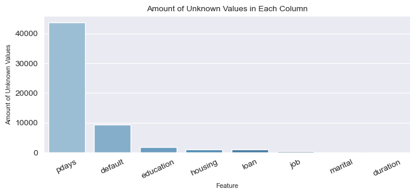
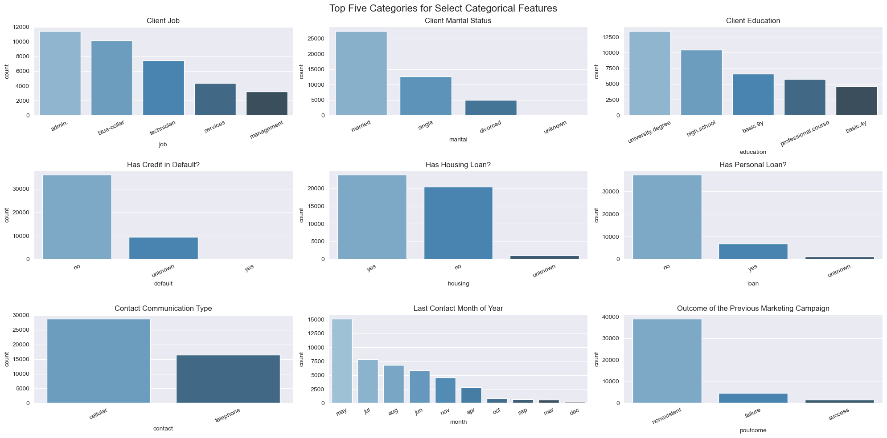
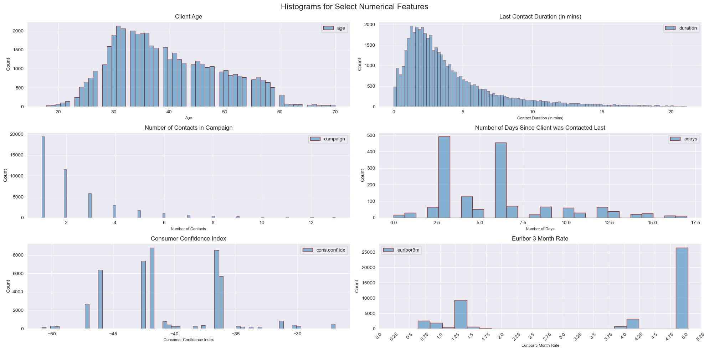
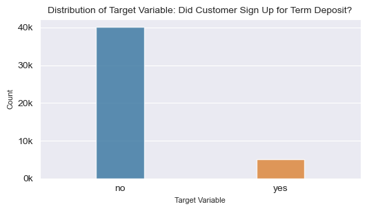
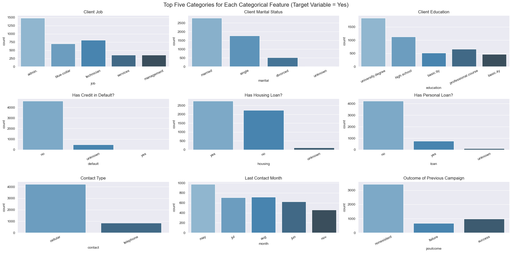
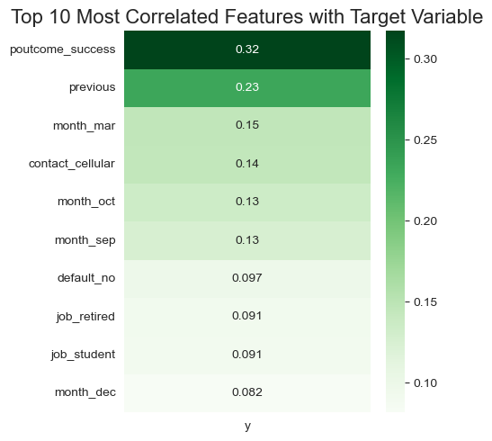
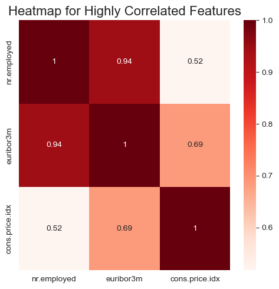
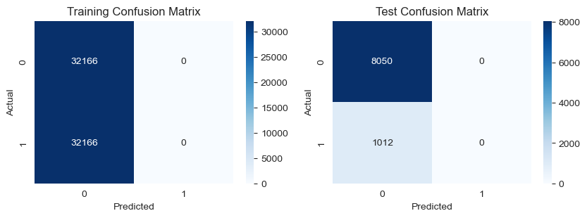
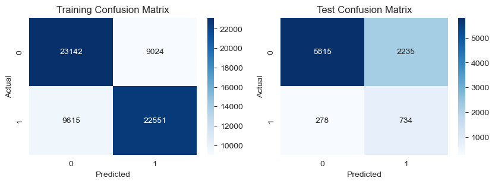
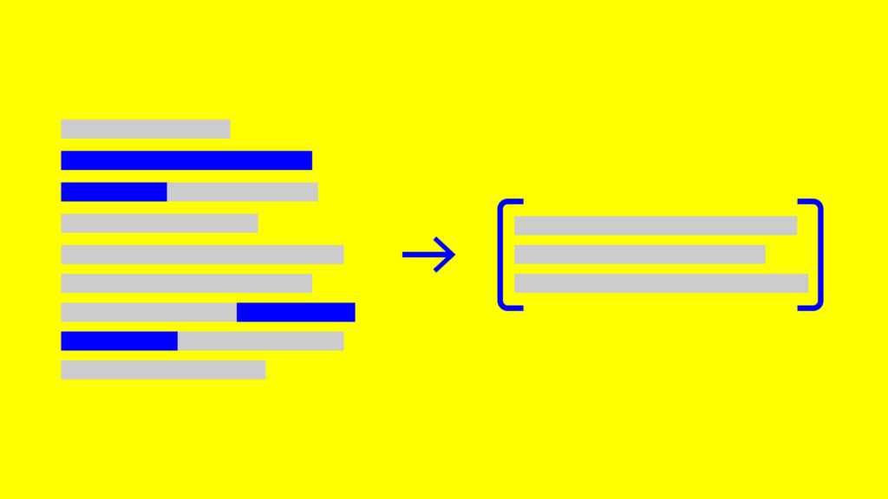

# **Dollars and Sense: Optimizing Bank Marketing Campaigns**

## *By Ryan Moore*
 
 

    

## **Table of Contents**
##### *Project Overview*
1. [README Introduction](#readme-introduction)
2. [Data](#data)
##### *Data Overview and Cleaning*
3. [Exploratory Data Analysis: Summary](#exploratory-data-analysis-summary)
4. [Data Preprocessing: Overview](#data-preprocessing)
##### *Modeling*
5. [Baseline Model](#baseline-model)
6. [Final Modeling](#final-modeling)
##### *Insights and Deployment*
7. [Feature Evaluation](#feature-evaluation)
8. [Model Evaluation](#model-evaluation)
9. [App Development and Deployment](#app-development)
##### *Conclusion*
10. [Conclusion](#finale)
11. [Repository Structure](#structure)

 
 

## **README Introduction**

This README is a summary of the technical notebook associated with this project, which can be found at "index.ipynb". This README is designed to provide an overview of the project, its visualizations, and its conclusions. The technical notebook provides a more in depth look at the project, including code, data cleaning, and modeling iterations.

This machine learning project does a deep dive into a bank marketing dataset to understand what features are most important to a marketing campaign's success, and then uses that understanding to build an optimized model and deploy that model to end users

The project has the following objectives:

1. **Determine feature importance**
    - Find out which features contribute the most to customer acquisition
2. **Build an optimized model**
    - To build a model that can predict whether a customer will subscribe to a term deposit or not, and
3. **Develop a no code app**
    - To be used my marketing teams to determine the probability an interaction will result in a customer subscribing to a term deposit

    

## **Data**
 

##### <ins>*Overview*</ins>
 

This [dataset](https://archive.ics.uci.edu/ml/datasets/Bank+Marketing) is from the UCI Machine Learning Repository and contains data from a Portuguese bank's marketing campaign.

The data was collected from May 2008 to November 2010

High level, dataset includes:

- 45,307 rows, each representing a customer interaction, and
- 21 feature columns, of which:
    - 11 are categorical features (such as customer education), and
    - 10 are numerical features (such as customer age)

The target variable is the "y" column, which indicates whether a customer subscribed to a term deposit or not.

##### <ins>*Additional Considerations*</ins>
 

Note that missing data in this dataset is denoted in two ways per the dataset documentation:
- "unknown" for categorical features, and
- "999" for numerical features 

We will handle these missing values in the **Data Preprocessing** section but have some special considerations for visualizing them in the visualizations below. See the index.ipynb file for more details.

 
 

    

 
 

## **Exploratory Data Analysis: Illustrations and Summary**

The following are the EDA visualizations taken from the index.ipynb file. These were used to help us understand the data and its features and their distributions. We started with all the features and their distributions, and then focused on the features and distributions of the subset where the customer subscribed to a term deposit.

##### <ins>*Evaluating for missing values*</ins>
 
 

    

 
 

##### <ins>*Categorical Features: Distributions*</ins>
 
 

    

 
 

##### <ins>*Numerical Features: Distributions*</ins>
 
 

    

 
 

##### <ins>*Target Variable: Distribution*</ins>
 
 

    

 
 

##### <ins>*Where Target = "yes": Categorical Variable Spread*</ins>
 
 

    

 
 

##### <ins>*Where Target = "yes": Numerical Variable Spread*</ins>
 
 

    

 
 

##### <ins>*Correlation to Target: Features*</ins>
 
 

    

 
 

##### <ins>*Investigating Collinearity Between Features*</ins>
 
 

    

 
 

## **Exploratory Data Analysis: Summary**

In summary, we found the following insights as a result of our exploratory data analysis:

##### <ins>*High Level Data Findings*</ins>
 

- The dataset has features which can broadly be categorized as:

    - Client data *(such as age, job, marital status, etc.)*
    - Campaign data *(such as number of contacts, days since last contact, etc.)*, and
    - External data *(such as consumer price index, employment variation rate, etc.)*
 
 
- Most of the data is categorical, with only 10% of the columns being numerical

- The dataset is mostly complete, with only 1% of records having missing data excluding the default and pcontact category. Of that 1%, half have one missing field and most others have two. Records missing more than two fields are rare

    - Note: the 'default' feature is considered separate from the other features when evaluating missing data because this category likely extends to if the customer has defaulted credit **anywhere**, not just with the bank running the campaign. This is likely a very sensitive topic and the call center agents may not have been advised to ask about it. This is likely why the default category contains by far the most 'unknown' values
     
     
    -Note: the 'pcontact' feature is considered separate from the other features when evaluating missing data because most customers contacted have not been contacted before. This is likely why the pcontact category contains by far the most 'unknown' values

##### <ins>*Feature Findings*</ins>
 

- The average age is around 30, with the majority of customers being between 30 and 40 years old
 
 
- The majority of customers are highly educated and have families
 
 
- The job feature is very vague, with most customers having an 'admin' or 'blue collar' job
 
 
- The majority of customers have not been contacted before, and the majority of customers have been contacted less than 5 times
 
 
- The majority of customers have not been contacted in the last 3 months, and the majority of customers have been contacted less than 10 days ago

##### <ins>*Target Variable Findings*</ins>

- The target variable is imbalanced, with only 11% of customers subscribing to a term deposit
 
 
- Customers who subscribe to a term deposit are generally older, have higher education, and have higher incomes
 
 
- Customers who subscribe to a term deposit are generally contacted more frequently, and have been contacted more recently
 
 
- Customers who have subscribed to a term deposit in the past are more likely to subscribe again as indicated by the correlation between the 'poutcome' and 'y' features
 
 
- An interesting finding is that EURIBOR 3 month rate trends lower for customers who subscribe to a term deposit. We would expect the opposite, as a lower rate would mean a lower return on investment for the bank. This could be due to the fact that the bank is offering a higher rate to customers who subscribe to a term deposit, or it could be due to the fact that the bank is offering a lower rate to customers who do not subscribe to a term deposit. This is something to keep in mind when modeling

## **Data Preprocessing: Overview**

In order to prepare the data for modeling, we will perform the following steps:

##### <ins>*Before the train / test split*</ins>
 

1. *Cast object data types as the category data type and ordinate the categories where applicable*
    - We will cast the object data types as the category data type to save memory and improve performance
    - We will ordinate the categories where applicable
        - For example, we will ordinate the 'education' feature from least to most education
 
 

2. *Drop features*
    - We will drop the 'duration' feature because it is not known before a call is performed
    - We will drop the 'default' feature because it is contains many missing values and is not heavily correlated with the target variable

##### <ins>*Train / test split*</ins>
 

3. *Split data into train and test sets*
    - We will split the data into train and test sets using an 80/20 split

##### <ins>*After the train / test split*</ins>
 

4. *Perform SMOTE oversampling on the train set*
    - We will perform SMOTE oversampling on the train set to balance the target variable
 
 

5. *Encode categorical features*
    - We will encode the categorical features using a one-hot encoding function
 
 

6. *Scale numerical features*
    - We will scale the numerical features using the standard scaler

 

    

## **Modeling Considerations and Baseline Model**
 

##### <ins>*Modeling Considerations*</ins>
 

Our primary metric for evaluating our models will be **recall**, as we want to minimize the number of customers who would subscribe to a term deposit that we do not contact. 

From a marketing strategy perspective, we are not very sensitive to false positives, as we would rather contact a customer who would not subscribe to a term deposit than not contact a customer who would subscribe to a term deposit. A false positive is just a cold-call that does not result in any new business, which as we saw in our target variable EDA, tends to happen most of the time.

No call center is perfect but this machine learning method would at least point the call center in the right direction in terms of who to contact first so time is not wasted with low probability cold-calls. 

We will use accuracy, precision, f1 score, and AUC as secondary metrics to evaluate our models to make sure we are not overfitting to the recall metric causing the other metrics to fall to single digits / zero.

##### <ins>*Baseline Model (Dummy Classifier)*</ins>
 

------------TRAINING RESULTS--------------
 Train AUC: 0.5
 Train Accuracy: 0.5
 Train Precision: 0.0
 Train Recall: 0.0
 Train F1: 0.0

------------CROSS VALIDATION--------------
 Cross Validation AUC: 0.5
 Cross Validation Accuracy: 0.49
 Cross Validation Precision: 0.09
 Cross Validation Recall: 0.2
 Cross Validation F1: 0.13

------------TEST RESULTS------------------
 Test AUC: 0.5
 Test Accuracy: 0.88
 Test Precision: 0.0
 Test Recall: 0.0
 Test F1: 0.0
 
 

    

 
The dummy classifier performance will be used as a baseline model to compare our other models to. 
 
 
In practice, the dummy classifier is a classifier that makes random predictions based on the class distribution of the training set. As you can see, it simply predicts all test set interactions as zero, which is technically pretty accurate based off of the test set composition, but since our key metric is recall this is not a well performing model. 

As far as starter models go though, this is a good baseline model because it is a good representation of a model that does not use any machine learning. This is important because we want to make sure that our machine learning models are actually improving upon the baseline model
 
 

------------TRAINING RESULTS--------------
 Train AUC: 0.71
 Train Accuracy: 0.71
 Train Precision: 0.71
 Train Recall: 0.70
 Train F1: 0.71

------------CROSS VALIDATION--------------
 Cross Validation AUC: 0.75
 Cross Validation Accuracy: 0.71
 Cross Validation Precision: 0.71
 Cross Validation Recall: 0.70
 Cross Validation F1: 0.71

------------TEST RESULTS------------------
 Test AUC: 0.72
 Test Accuracy: 0.72
 Test Precision: 0.25
 Test Recall: 0.73
 Test F1: 0.37
 
 

    

 

##### <ins>*Top 5 Features*</ins>

<table style="font-size: 14px; padding: 5px; margin: 5px;">
<table>
  <tr>
    <th>Feature</th>
    <th>Absolute Importance</th>
  </tr>
  <tr>
    <td>euribor3m</td>
    <td>24 %</td>
  </tr>
  <tr>
    <td>poutcome_success</td>
    <td>10 %</td>
  </tr>
  <tr>
    <td>emp.var.rate</td>
    <td>2.6 %</td>
  </tr>
  <tr>
    <td>month_may</td>
    <td>0 %</td>
  </tr>
  <tr>
    <td>loan_unknown</td>
    <td>0 %</td>
  </tr>
</table>
 

## **Feature Evaluation and Analysis**

##### <ins>*Feature Importance*</ins>

As we can see, there are really only **three features** that the model is relying on to make predictions. These features are:

- The current EURIBOR 3 month rate (euribor3m, negative coefficient of -.237)
- The status of the customer's decision to take a term deposit in the past (poutcome, positive coefficient of .104), and
- The employment variation rate (emp.var.rate, negative coefficient of -.02)

Currently, the model is **not using any other features** as they do not appear to be significant in determining whether or not a customer will subscribe to a term deposit. This is not surprising, as we saw in our EDA that **only a few features** were correlated with the target variable, the highest being the if the customer previously subscribed to a term deposit (poutcome).

##### <ins>*Considering Missing Features*</ins>

There are a couple of reasons why the model may not be using the features in the dataset when this problem is thought about from a business perspective. There are a few key elements the data set is missing that would be very helpful in determining whether or not a customer will subscribe to a term deposit. To name just a few:

- *The term deposit rate offered to the customer*
    - The attractiveness of the interest rate offered to the customer is likely the most important factor in determining whether or not a customer will subscribe to a term deposit. 
    - If the rate is attractive and is higher than the current market rate, the customer is more likely to subscribe to a term deposit as an investor would get more on their return. 
    - EURIBOR and the employment variation rate are decent indicators of how the market is performing and how strong the economy is, but they are not the same as the actual rate offered to the customer which would be highly applicable to the customer's decision to subscribe to a term deposit
- *The customer's current financial situation*
    - The customer's current financial situation is another important missing factor. If the customer is in a good financial situation with a solid balance sheet, they are more likely to subscribe to a term deposit as they are more likely to have the liquid assets to invest. 
    - We could only loosely infer this based on the customer's education level and job. This is not a good way to determine the customer's current financial situation for two reasons: 
        - A customer with a high education level and a high paying job could still be in a bad financial situation if they have a lot of debt from student loans or a mortgage, and
        - As we saw in the EDA, the education level and job are categorical variables that within themselves could have a lot of variation not detailed in this dataset (i.e., many of the jobs were just labeled 'admin' or 'blue-collar' and not specific enough to determine the customer's financial situation)
- *The customer's current financial goals*
    - The customer's current financial goals are likely the third most important factor in determining whether or not a customer will subscribe to a term deposit and it is not included in the dataset. If the customer is looking to invest in a term deposit to save for retirement, they are more likely to subscribe to a term deposit. 
    - We could only loosely infer this based on the customer's age. This is not a good way to determine the customer's current financial goals for two reasons: 
        - A customer's age does not necessarily correlate with their financial goals, and
        - The customer's age is a continuous variable that within itself could have a lot of variation not detailed in this dataset (i.e., a customer could be 30 years old and be saving for retirement, or a customer could be 60 years old and be saving for a down payment on a new house)

## **Model Evaluation Considerations**

Our baseline model was a dummy classifier that predicted all test set interactions as zero. This model was decently accurate, but not practical as it did not predict any of the customers who would subscribe to a term deposit.

Our final model had the following scores:

- Test AUC: 72%
- Test Accuracy: 73%
- Test Precision: 25%
- Test Recall: 73%
- Test F1: 39%

The final model is a significant improvement over the baseline model, as it can predict 73% of the customers who would subscribe to a term deposit. 

Since we optimized for recall and minimized false negatives (model predicts they won't, when in reality they will), the call center will cast a wider net over its customer base and contact more customers who may subscribe to a term deposit at the cost of some additional false positives (model predicts they will, when in reality they don't). 

After all, it is less costly to spend a few minutes trying to contact and sell a term deposit to a customer than it is to miss out on potential business.

    

## **App Development and Deployment**

In order to deploy the model to the marketing team, we will need to develop a no code app that can be used to determine the probability an interaction will result in a customer subscribing to a term deposit.

We will use Streamlit to develop the app to be deployed on local machines.

Our high level workflow will be as follows:

1. Marketing employee inputs a list of customer leads into the app
2. The app will perform the following steps:
    - Clean the data
    - Perform the same preprocessing steps as the model
    - Make predictions using the model
    - Return the predictions to the marketing employee
3. The marketing employee will use the predictions to prioritize which customers to contact first

**Please see the App folder for the code used to develop the app**

    

## **Conclusion and Next Steps**

##### <ins>*High-Level Summary*</ins>
 

In this project, we were able to utilize the dataset from a Portuguese bank to develop a model that can predict whether or not a customer will subscribe to a term deposit.
 
 
Recall was our primary metric of interest, as we wanted to minimize the number of customers who would subscribe to a term deposit and not be contacted by the call center.
 
 
While there were not many existing features that were relevant in determining if a customer would subscribe, there were enough to develop a model that can predict 73% of the customers who would subscribe to a term deposit. This model is a significant improvement over the baseline model, which had a recall of 0.0 and an accuracy of 50%. The limitations of the data and features that would be highly relevant in determining if a customer would subscribe (product on offer, customer financial situation and needs, etc) to a term deposit were also discussed.
 
 
We were also able to develop a no code app that can be used by the marketing team to determine the probability an interaction will result in a customer subscribing to a term deposit. The app can be deployed locally on machines, however there are some limitations to the app that would need to be addressed if it were to be deployed in a real-life scenario.

##### <ins>*Next Steps*</ins>
 

If this were a real-life project and were to be deployed to the marketing team, there are a few next steps that would need to be taken to ensure the model is being used effectively and is helping the marketing team achieve its goals:

- **Collect more data points and data features** - The dataset is useful for a baseline model, but there are certain data features that would be highly relevant in determining if a customer would subscribe to a term deposit (product on offer, customer financial situation and needs, etc) that are not included in the dataset. If the marketing team were to collect more data points and data features, they would be able to develop a more accurate model that can predict more customers who would subscribe to a term deposit.

- **Develop a more robust app** - The app that was developed for this project is a no code app that can be used to determine the probability an interaction will result in a customer subscribing to a term deposit. However, there are some limitations to the app that would need to be addressed if it were to be deployed in a real-life scenario. For example, the app can only be deployed locally on machines and cannot yet be deployed on the cloud.

- **Have the model automatically retrain itself** - If the app is deployed, the model will need to be retrained on a regular basis to ensure it is up to date with the latest data. If there was an established workflow around using the app and the necessary code is written, the model could be retrained automatically on a regular basis.

## **Structure of this Repo**

This is the README file. The repo is structured as follows:

- **App** - Contains the code used to develop the app
- **Data** - Contains the data used for this project
- **Images** - Contains the images used in the README and index file
- **index.ipynb** - Contains the analysis seen in this readme as well as the code used to develop everything mentioned in this readme
- **presentation.pdf** - Contains the non-technical slides used to present this project

